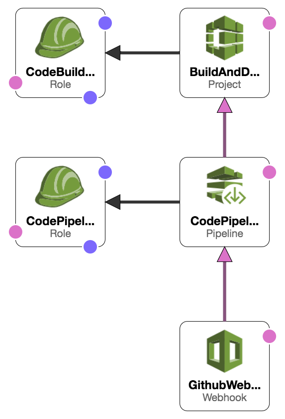

# [GoBitcoinSV](https://gobitcoinsv.com)
> A collection of go projects for building on Bitcoin SV

[](https://github.com/BitcoinSchema/gobitcoinsv/commits/master)
[](https://github.com/BitcoinSchema/gobitcoinsv/releases)
[](https://github.com/RichardLitt/standard-readme)
[](https://gobitcoinsv.com)
[](https://github.com/sponsors/BitcoinSchema)
[](https://gobitcoinsv.com/#sponsor)

<br/>


<br/>

## Table of Contents
- [Installation](#installation)
- [Documentation](#documentation)
- [Examples](#examples)
- [Code Standards](#code-standards)
- [Usage](#usage)
- [Maintainers](#maintainers)
- [Contributing](#contributing)
- [License](#license)

<br/>

## Installation
Install the web application
```shell script
make install
```

View the site:
`open /public/index.html in a web browser`

<br/>

### Deployment & Hosting
This repository has CI integration using [AWS CodePipeline](https://aws.amazon.com/codepipeline/).

The build in AWS will deploy to [firebase](https://firebase.google.com).

The actual build process can be found in the [buildspec.yml](buildspec.yml) file.

The application relies on [AWS Secrets Manager](https://aws.amazon.com/secrets-manager/)
and [AWS SSM](https://aws.amazon.com/systems-manager/features/) to store environment variables.
Sensitive environment variables are encrypted using [AWS KMS](https://aws.amazon.com/kms/) and then decrypted at runtime.

Deploy different environments by changing the `<stage>` to `production` or `developement` as example.
The default stage is `production` if it's not specified.

<details>
<summary><strong><code>Firebase Hosting Setup</code></strong></summary>
<br/>

1) Start a new project and assign a CNAME
2) Make sure the region is us-central
3) Generate a CI `firebase_token` using the command: `firebase login:ci`
</details>

<details>
<summary><strong><code>Create Environment Encryption Key(s) (AWS)</code></strong></summary>
<br/>

Create a `KMS Key` per `<stage>` for your application(s) to encrypt environment variables
```shell script
make create-env-key stage="<stage>"
```

This will also store the `kms_key_id` in  [SSM](https://aws.amazon.com/systems-manager/features/) located at: `/<application>/<stage>/kms_key_id`

</details>

<details>
<summary><strong><code>Manage Environment Variables (AWS)</code></strong></summary>
<br/>

- `app_id` is the Firebase application id for the [project](https://firebase.google.com/docs/projects/learn-more)
- `project` is the [Firebase project_id](https://firebase.google.com/docs/projects/learn-more)
- `sender_id` is the Firebase sender_id for the [project](https://firebase.google.com/docs/projects/learn-more)

Add or update your project information _(all parameters are required)_
```shell script
make firebase-save-project \
      app_id="YOUR_APP_ID" \
      project="YOUR_PROJECT_ID" \
      sender_id="YOUR_SENDER_ID" \
      stage="<stage>"
```
</details>

<details>
<summary><strong><code>Manage Environment Secrets (AWS)</code></strong></summary>
<br/>

- `firebase_api_key` is found in the Firebase console for that specific project
- `firebase_token` is the `ci:login` token that is generated from `firebase login:ci`
- `github_token` is a personal token with access to make a webhook
- `kms_key_id` is from the previous step (Create Environment Encryption Keys)

Add or update your secrets _(all parameters are required)_
```shell script
make save-secrets \
      firebase_api_key="YOUR_FIREBASE_API_KEY" \
      firebase_token="YOUR_FIREBASE_CI_TOKEN" \
      github_token="YOUR_GITHUB_TOKEN" \
      kms_key_id="YOUR_KMS_KEY_ID" \
      stage="<stage>"
```
</details>

<details>
<summary><strong><code>Create CI Environment (AWS)</code></strong></summary>
<br/>



**Prerequisites**
- [An AWS account](https://aws.amazon.com/)
    - _Deploying_ requires permission to: [KMS](https://aws.amazon.com/kms/), [SSM](https://aws.amazon.com/systems-manager/features/), [Secrets Manager](https://aws.amazon.com/secrets-manager/) and [Cloud Formation](https://aws.amazon.com/cloudformation/)
- [AWS CLI](https://docs.aws.amazon.com/cli/latest/userguide/installing.html)  _(`brew install awscli`)_
- [SAM CLI](https://docs.aws.amazon.com/serverless-application-model/latest/developerguide/serverless-sam-cli-install-mac.html) _(`brew tap aws/tap && brew install aws-sam-cli`)_

This will create a new [AWS CloudFormation](https://aws.amazon.com/cloudformation/) stack with:
- (1) [CodePipeline](https://aws.amazon.com/codepipeline/) with multiple stages to deploy the application from Github
- (1) [CodePipeline Webhook](https://aws.amazon.com/codepipeline/) to receive Github notifications from a specific `branch:name`
- (1) [CodeBuild Project](https://docs.aws.amazon.com/codebuild/latest/userguide/create-project.html) to build and deploy the app
- (2) [Service Roles](https://docs.aws.amazon.com/IAM/latest/UserGuide/id_roles_create_for-service.html) for working with CodeBuild and CodePipeline

**NOTE:** Requires an existing S3 bucket for artifacts and sam-cli deployments (located in the [Makefile](Makefile))

One command will build, test, package and deploy the application to AWS.
After initial deployment, updating is as simple as committing to Github.
```shell script
make deploy
``` 

_(Example)_ Customized deployment for another stage
```shell script
make deploy stage="development" branch="development"
``` 

_(Example)_ Customized deployment for a feature branch
```shell script
make deploy stage="development" branch="some-feature" feature="some-feature"
```

_(Example)_ Customized S3 bucket location
```shell script
make deploy bucket="some-S3-bucket-location"
```

_(Example)_ Customized tags for the deployment
```shell script
make deploy tags="MyTag=some-value AnotherTag=some-value"
```  
</details>

<details>
<summary><strong><code>Tear Down CI Environment (AWS)</code></strong></summary>
<br/>

Remove the stack (using default stage: `staging`)
```shell script
make teardown
```   

_(Example)_ Teardown another stack via stage
```shell script
make teardown stage="development"
``` 

_(Example)_ Teardown a feature/branch stack
```shell script
make teardown stage="development" feature="some-feature"
```   
</details>

<br/>

## Documentation
No documentation at this time. View the [source code](public) of the website.

<details>
<summary><strong><code>Release Deployment</code></strong></summary>
<br/>

[goreleaser](https://github.com/goreleaser/goreleaser) for easy binary or library deployment to Github and can be installed via: `brew install goreleaser`.

The [.goreleaser.yml](.goreleaser.yml) file is used to configure [goreleaser](https://github.com/goreleaser/goreleaser).

Use `make release-snap` to create a snapshot version of the release, and finally `make release` to ship to production.
</details>

<details>
<summary><strong><code>Makefile Commands</code></strong></summary>
<br/>

View all `makefile` commands
```shell script
make help
```

List of all current commands:
```text
audit                         Checks for any packages that are vulnerable
aws-param-certificate         Returns the ssm location for the domain ssl certificate id
aws-param-zone                Returns the ssm location for the host zone id
clean                         Remove previous builds, cache or install modules
create-env-key                Creates a new key in KMS for a new stage
create-secret                 Creates an secret into AWS SecretsManager
decrypt                       Decrypts data using a KMY Key ID (awscli v2)
decrypt-deprecated            Decrypts data using a KMY Key ID (awscli v1)
deploy                        Build, prepare and deploy
encrypt                       Encrypts data using a KMY Key ID (awscli v2)
env-key-location              Returns the environment encryption key location
firebase-deploy-simple        Deploys to firebase with limited flags
firebase-get-env              Gets the current environment variables in the associated project
firebase-param-app-id         Returns the location of the app_id parameter in SSM
firebase-param-location       Creates a parameter location (for Firebase details in SSM)
firebase-param-project        Returns the location of the project-id parameter in SSM
firebase-param-sender-id      Returns the location of the sender_id parameter in SSM
firebase-save-project         Saves the firebase project information for use by CloudFormation
firebase-set-env              Set an environment variable in a firebase project
firebase-update               Update the firebase tools
help                          Show this help message
install                       Install the application
invalidate-cache              Invalidates a cloudfront cache based on path
lint                          Run the JS linter
outdated                      Checks for any outdated packages
package                       Process the CF template and prepare for deployment
reinstall                     Removes all files and re-installs from scratch
release                       Full production release (creates release in Github)
release-snap                  Test the full release (build binaries)
release-test                  Full production test release (everything except deploy)
replace-version               Replaces the version in HTML/JS (pre-deploy)
save-domain-info              Saves the zone id and the ssl id for use by CloudFormation
save-param                    Saves a plain-text string parameter in SSM
save-param-encrypted          Saves an encrypted string value as a parameter in SSM
save-secrets                  Helper for saving sensitive credentials to Secrets Manager
tag                           Generate a new tag and push (tag version=0.0.0)
tag-remove                    Remove a tag if found (tag-remove version=0.0.0)
tag-update                    Update an existing tag to current commit (tag-update version=0.0.0)
teardown                      Deletes the entire stack
update-secret                 Updates an existing secret in AWS SecretsManager
upload-files                  Upload/puts files into S3 bucket
```
</details>

<br/>

## Examples
View the live [website](https://gobitcoinsv.com)

<br/>

## Code Standards
Always use the language's best practices!

<br/>

## Usage
We're using it! Visit the [GoBitcoinSV](https://gobitcoinsv.com) website.

<br/>

## Maintainers
| [](https://github.com/rohenaz) | [](https://github.com/mrz1836)
|:---:|:---:|
| [Satchmo](https://github.com/rohenaz) | [MrZ](https://github.com/mrz1836)|

<br/>

## Contributing

View the [contributing guidelines](CONTRIBUTING.md) and follow the [code of conduct](CODE_OF_CONDUCT.md).

### How can I help?
All kinds of contributions are welcome :raised_hands:!
The most basic way to show your support is to star :star2: the project, or to raise issues :speech_balloon:.
You can also support this project by [becoming a sponsor on GitHub](https://github.com/sponsors/BitcoinSchema) :clap:
or by making a [**bitcoin donation**](https://gobitcoinsv.com/#sponsor) to ensure this journey continues indefinitely! :rocket:

<br/>

## License

